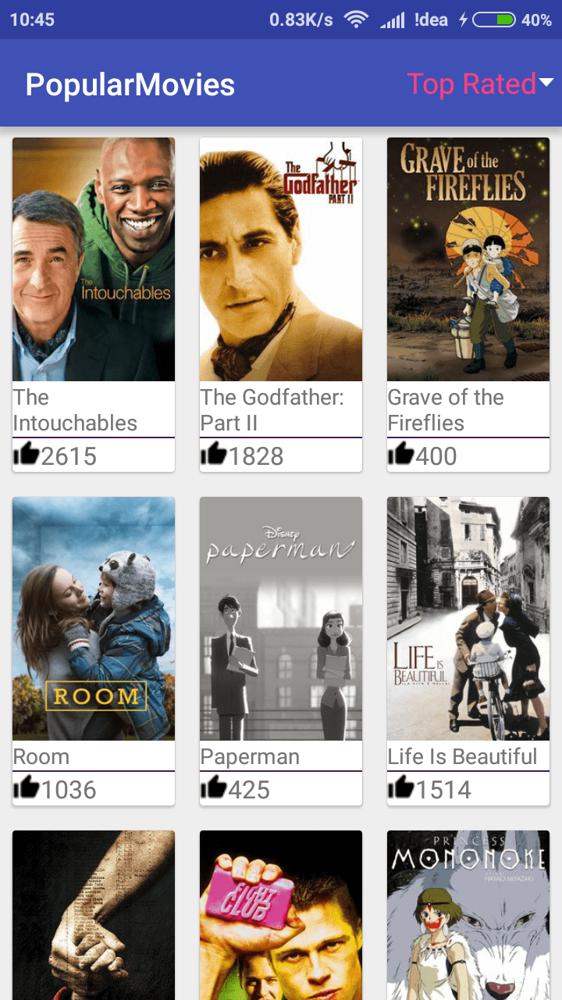
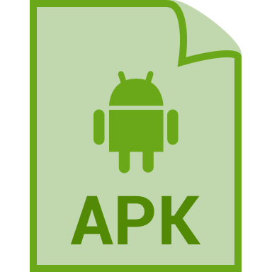

# PopularMovies
Popular Movies android app for project submission in android nanodegree program at udacity.

<ol>
<li>Consuming The Movie Database Api</li>
<li>Material Design Implementation</li>
<li>Multiscreen Tablet support</li>
<li>Content Providers</li>
<li>MVP Architecture Implmentation</li>
</ol>

## Api key is stored via gradle file , you need to add the movie database api key to built and run this app.

# Screenshots 

 
## Download APK

